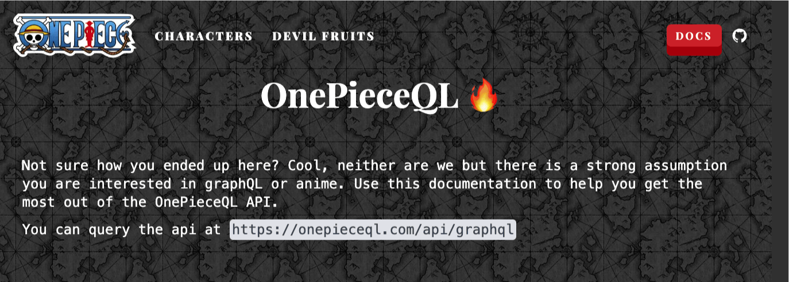

# onepieceQL


## 📖 Overview

Not sure how you ended up here? Cool, neither are we but there is a strong assumption you are interested in graphQL or anime. Use this documentation to help you get the most out of the OnePieceQL API.

You can query the api at https://onepieceql.com/api/graphql

## 🚀 Tech Stack

- **Next.js**
- **Apollo Client/Server**
- **Tailwind CSS**
- **Drizzle ORM**
- **PostgreSQL**

## 🛠️ Getting Started

Make sure you have docker installed.
```bash
docker compose up # or docker-compose up
```

## 📚 Resources

- **[One Piece Wiki](https://onepiece.fandom.com/wiki/One_Piece_Wiki)**: A comprehensive resource for all things One Piece, helping you understand the lore and background of the world.
- **[One Piece Manga](https://ww7.readonepiece.com/)**: Stay up-to-date with the latest chapters of the One Piece manga.


## 🤝 Contributing

We welcome contributions! If you’d like to contribute, please fork the repository and use a feature branch. Pull requests are warmly welcome.
